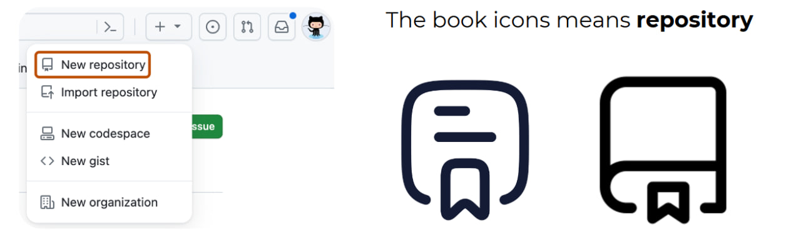
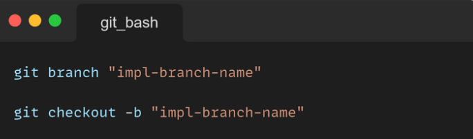
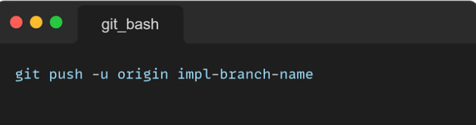

# Дар дарсҳои охир ман чиро ёд гирифтам:

- Repository сохтанро
- Кор кардан бо Repository
- Branch сохтанро
- Кор кардан бо Branch
- боз командаҳои асосиро ёд гирифтам
---

# Repository  - (repo)-шакли кутоҳ, макони мутамарказест,ки дар он код файлҳо ва ҳуҷатҳои лоиҳа ҳифз ва идора карда мешаванд.

# Чӣ тавр сохтани Repository?
## - Якчанд роҳҳои маъмули сохтани Repo вуҷуд доранд, вобаста аз он ки шумо кадом асбобро истифода мекунед. Инҳоянд роҳи осони эҷоди репо ба саҳифаи github равед ва ин ҷойҳоро пайдо кунед.
# нишонаҳои китоб дар сурати зерин маънои сохтани repository - ро дорад.

# Боз сохтани repo - ро мо дар git сохта метавонем, бо командаҳои зерин:
- git init
- git add "example"
- git commit -m "name"
- git branch -M main
- git remote add origin "роҳи репо"
- git push -u origin main
---

# git init - барои сохтани репо -и холи
# git add  - барои ворид кардани ягон файл ё ин ки агар мо . - "нуқтаро" монем ҳама файлҳоро ворид карда метавонем.
# git commit -m "name" - Барои сохтани комит
# git branch -M main -  Барои сохтани шоха.
# git remote add origin "роҳи репо" - Барои нишон додани роҳи Repository.
# git push -u origin main - барои фиристодани тағйиротҳо аз git ба github яъне бв репои мо.

# Branch чист?
## Branch - барои сохтани шоха истофода бурда мешавад. Шоха local & origin мешавад.
# Чӣ тавр Branch - ро месозан?
## branch - ро бо ду роҳ сохта метавонем:
- git baranch "impl-branch-name"
- git checkout -b "impl-branch-name"
---

# git baranch "impl-branch-name" - Фармони зерин ба мо имконият медиҳад, ки мо якто шоха созем.
# git checkout -b "impl-branch-name" - Фармони зерин ба мо имконият медиҳад, ки мо якто шоха созем ва дар даруни он дароем.

# Пас аз он ки мо шохаҳоро сохтем ба origin repository шохаҳои худамонро равон кунем.

# Барои маълумоти бештар гирифтан ба ссылкаи зерин зер кунед: [Git licture](https://www.canva.com/design/DAGVUpzDTpU/NG4q5FXH4TRe4yvetU3N-g/view?utm_content=DAGVUpzDTpU&utm_campaign=designshare&utm_medium=link&utm_source=editor#10)

